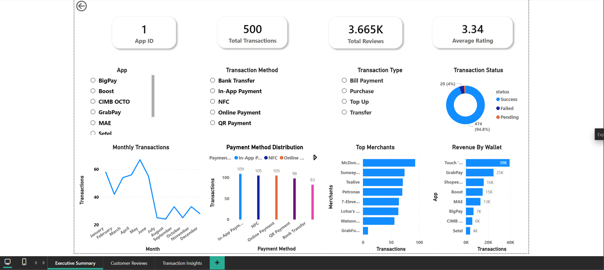
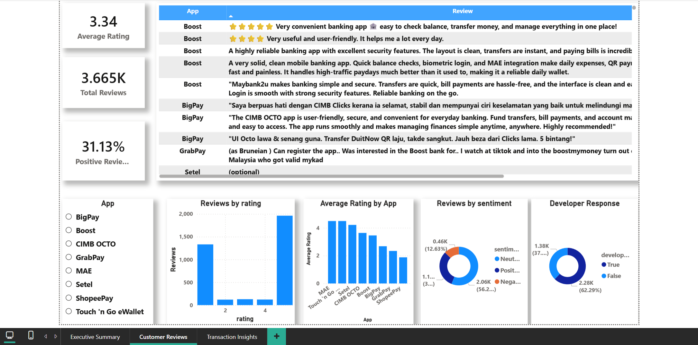
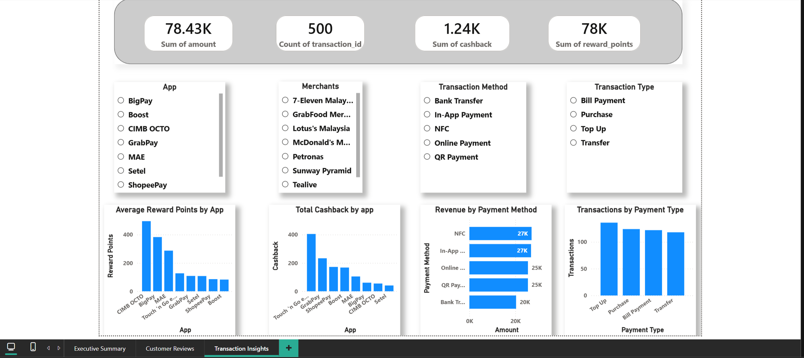

# 💳 WalletWatch

An end-to-end **Data Analytics** project that analyzes Malaysian digital wallet transactions and customer reviews using **PostgreSQL, SQL, Python, Power BI, Excel, Git, and GitHub**.

WalletWatch demonstrates a complete analytics workflow—from data collection and cleaning to database design, SQL analysis, and interactive business intelligence dashboards.

---

# 📌 Project Overview

WalletWatch combines **synthetic transaction data** with **real public customer reviews** to analyze the performance of Malaysia's most popular digital wallet applications.

The project simulates a real-world analytics workflow and showcases database development, ETL, SQL querying, and Power BI dashboard creation.

---

# 📊 Dashboard Preview

## 📈 Executive Summary



Provides a high-level overview of wallet performance, revenue, transactions, cashback, reward points, merchant activity, payment methods, and monthly transaction trends.

---

## ⭐ Customer Reviews



Analyzes customer ratings, sentiment distribution, developer responses, review volume, and authentic customer feedback collected from public app stores.

---

## 💳 Transaction Insights



Explores transaction behavior through payment methods, wallet revenue, cashback analysis, reward points, transaction types, and merchant performance.

---

# 🎯 Project Objectives

- Design and build a normalized PostgreSQL database
- Generate realistic synthetic transaction data using Python
- Collect and clean public customer reviews
- Perform business analysis using SQL
- Develop interactive Power BI dashboards
- Demonstrate an end-to-end data analytics workflow

---

# ⭐ Project Highlights

- Designed a fully normalized PostgreSQL database
- Built a complete SQL database from scratch
- Generated realistic synthetic transaction data using Python
- Collected and cleaned thousands of public customer reviews
- Created reusable SQL scripts for database creation and analysis
- Developed three interactive Power BI dashboards
- Built a complete ETL workflow from raw data to visualization

---

# 🛠 Tech Stack

## Database
- PostgreSQL

## Programming
- Python
- SQL

## Data Visualization
- Power BI
- Excel

## Libraries
- Pandas

## Version Control
- Git
- GitHub

---

# 📂 Project Structure

```text
WalletWatch
│
├── Data
│   ├── Raw
│   ├── Clean
│   └── Import
│
├── Python
│
├── SQL
│
├── PowerBI
│
├── Screenshots
│
├── docs
│
├── README.md
│
└── requirements.txt
```

---

# 🔄 Data Workflow

```text
Google Play Reviews
          │
          ▼
Python Data Cleaning
          │
          ▼
Clean CSV Files
          │
          ▼
PostgreSQL Database
          │
          ▼
SQL Analysis
          │
          ▼
Power BI Dashboards
          │
          ▼
Business Insights
```

---

# 🗄 Database Design

The project consists of seven normalized relational tables:

- Companies
- Apps
- Users
- Review Users
- Merchants
- Transactions
- Reviews

The database is designed using:

- Primary Keys
- Foreign Keys
- Relational Constraints
- One-to-Many Relationships

---

# 📈 Dashboard Pages

## 📊 Executive Summary

Business overview including:

- Total Revenue
- Total Transactions
- Cashback
- Reward Points
- Monthly Transactions
- Revenue by Wallet
- Top Merchants
- Payment Methods
- Transaction Status

---

## ⭐ Customer Reviews

Customer feedback analysis including:

- Total Reviews
- Average Rating
- Reviews by Wallet
- Average Rating by Wallet
- Rating Distribution
- Sentiment Distribution
- Developer Response Rate
- Customer Review Table

---

## 💳 Transaction Insights

Transaction analysis including:

- Wallet Revenue
- Cashback Analysis
- Reward Points
- Payment Method Distribution
- Monthly Transactions
- Top Merchants
- Transaction Types

---

# ❓ Business Questions Answered

This project answers business questions such as:

- Which wallet generates the highest revenue?
- Which wallet processes the most transactions?
- Which merchants receive the highest transaction volume?
- Which payment methods are most popular?
- How do transaction trends change over time?
- Which wallets provide the highest cashback?
- Which wallets provide the highest reward points?
- Which wallets receive the highest customer ratings?
- What is the overall customer sentiment?
- Do developers actively respond to customer feedback?

---

# 📥 Data Sources

Customer reviews were collected from publicly available sources.

### Review Sources

- Google Play Store
- Apple App Store *(Planned for Version 2. Integration was not completed due to compatibility limitations with the available Python package. See `docs/review_collection_plan.md` for implementation details.)*

### Company Information

- Official company websites

### Transaction Data

Synthetic transaction data generated using Python for portfolio purpose.
.

---

# 📚 Documentation

Additional project documentation is available inside the **docs** folder.

Included documents:

- Review Collection Plan
- Review Sources
- Transaction Rules
- Application IDs

---

# 🚀 Future Improvements (Version 2)

WalletWatch Version 2 will include:

- 500,000+ synthetic transactions
- Larger user and merchant datasets
- Expansion to Southeast Asian digital wallets
- Apple App Store review integration
- Automated ETL pipeline
- NLP-based sentiment analysis
- Machine Learning predictions
- Advanced DAX calculations
- Interactive web dashboard deployment
- Additional Power BI dashboards

---

# 📌 Project Status

## ✅ WalletWatch Version 1 Completed

Current release includes:

- PostgreSQL relational database
- Python ETL pipeline
- SQL database creation scripts
- SQL analytical queries
- Interactive Power BI dashboards
- Complete project documentation

Future releases will expand the dataset and introduce more advanced analytics.

---

# 👨‍💻 Author

**Fardin Ahmed**

Data Analytics Portfolio Project

---

## ⭐ If you found this project interesting, feel free to star the repository and explore the code.

